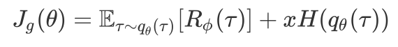

## Summary

This is implementation of the paper 'Toward Diverse Text Generation with Inverse Reinforcement Learning' https://arxiv.org/abs/1804.11258 IJCAI2018

## Requirement

Python >=2.7.12

Tensorflow >=1.2.0

nltk == 3.2.5

## Synthetic

```bash
python irl_generation.py
```

In experiment, we add weight **x** to entropy term so that it can be used to adjust the balance of 'quality' and 'diversity' of generated texts. The training process of various **x** is stored in the 'synthetic/save' folder.



| x      | 0.0   | 0.02  | 0.04  | 0.06 | 0.08 | 0.085 |
| :----- | ----- | ----- | ----- | ---- | ---- | ----- |
| Result | 0.916 | 0.918 | 0.914 | 2.89 | 3.46 | 6.91  |

| 0.09 | 0.095 | 0.1  | 0.11 | 0.12 | 0.14 | 0.16 |
| ---- | ----- | ---- | ---- | ---- | ---- | ---- |
| 4.78 | 7.36  | 8.38 | 7.76 | 8.24 | 8.03 | 8.26 |

| 0.25 | 0.35 | 0.5  | 0.75 | 1.0  | 1.25 | Ground Truth | MLE  |
| ---- | ---- | ---- | ---- | ---- | ---- | ------------ | ---- |
| 8.69 | 8.86 | 9.01 | 9.06 | 9.12 | 9.20 | 5.75         | 9.03 |

## Image COCO

```bash
python irl_coco.py
```

The results are under 50 epochs pretrain and 50 epochs irl training. Smooth function is not used in calucating BLEU(Same with LeakGAN github repo).

| x         | 0.35  | 0.45  | 0.55  | 0.65  | 0.75  |
| --------- | ----- | ----- | ----- | ----- | ----- |
| BLEU-2(f) | 0.924 | 0.889 | 0.901 | 0.830 | 0.827 |
| BLEU-3(f) | 0.851 | 0.789 | 0.800 | 0.671 | 0.647 |
| BLEU-4(f) | 0.772 | 0.690 | 0.710 | 0.573 | 0.556 |
| BLEU-5(f) | 0.724 | 0.624 | 0.656 | 0.564 | 0.571 |
| BLEU-2(b) | 0.813 | 0.851 | 0.846 | 0.881 | 0.883 |
| BLEU-3(b) | 0.689 | 0.733 | 0.715 | 0.761 | 0.754 |
| BLEU-4(b) | 0.614 | 0.657 | 0.632 | 0.667 | 0.652 |
| BLEU-5(b) | 0.590 | 0.627 | 0.605 | 0.618 | 0.606 |

we also tested with BLEU and Self-BLEU (see TexyGen for details) results are listed here, use same smooth function calculating BLEU in TexyGen github repo:

| x           | 0.35  | 0.45  | 0.55  | 0.65  | 0.75  |
| ----------- | ----- | ----- | ----- | ----- | ----- |
| BLEU-2      | 0.922 | 0.887 | 0.906 | 0.828 | 0.824 |
| BLEU-3      | 0.844 | 0.780 | 0.802 | 0.653 | 0.627 |
| BLEU-4      | 0.751 | 0.654 | 0.680 | 0.463 | 0.415 |
| BLEU-5      | 0.645 | 0.513 | 0.559 | 0.308 | 0.256 |
| Self-BLEU-2 | 0.936 | 0.899 | 0.892 | 0.829 | 0.831 |
| Self-BLEU-3 | 0.881 | 0.797 | 0.802 | 0.641 | 0.621 |
| Self-BLEU-4 | 0.829 | 0.701 | 0.716 | 0.464 | 0.408 |
| Self-BLEU-5 | 0.781 | 0.609 | 0.646 | 0.325 | 0.263 |

Examples of each weight are listed in imagecoco/speech.

Many thanks to SeqGAN and LeakGAN authors, part of my codes are modified from their codes.


